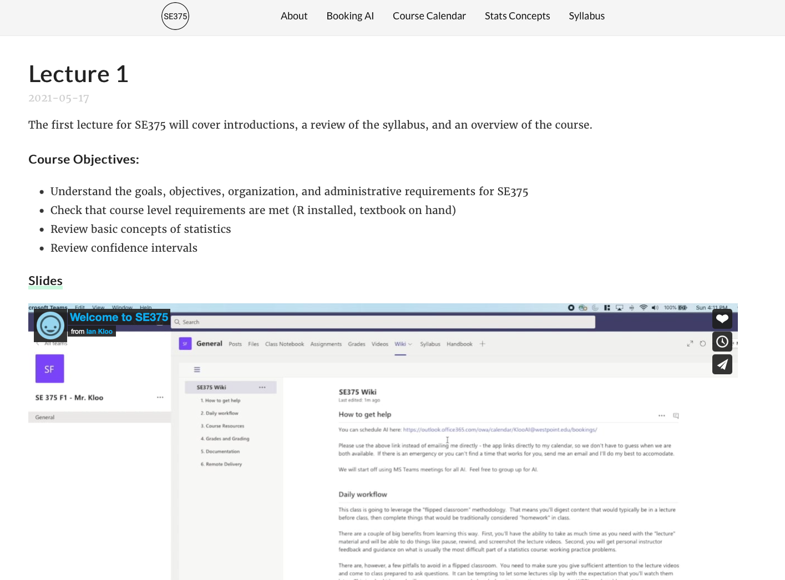

# Course Website Concept Demo

This site is a shell that could be used as the main web resource for a course.

[Link to running site](https://iankloo.github.io/course_site_demo)



### Design principles:

1. Aesthetically pleasing and professional appearance
    - Communication is more than just providing access to information
    - If folder-based structures (Blackboard, Teams, etc.) are "good enough", why do all of the websites we visit frequently not just have a folder structure?
    - Folder-based course sites communicate to students that we are doing the minimum for class prep (even when that isn't true).
2. Reduces number of clicks for students to get to content
    - All course material for each lesson should be available in one place.
    - It shouldn't take long for students to access multiple lessons (e.g., when studying for a test)
3. All course resources available and their locations obvious
    - Course resources like the syllabus and instructor information should be up-front and easy to access
4. Open source and platform agnostic
    - Using for-profit software means we depend on external developers to make products that work for us
    - Shifting between platforms can be difficult
    - Open source tools are prevalent and well-maintained in the academic space
5. Incorporates version control
    - Tracking changes to the course website becomes the process of tracking changes to the course.  This is a huge asset for knowledge management.
    - Github and Gitlab can serve as the repository of the site code as well as the (free) hosting solution 

### Limitations:

1. No user engagement (e.g., discussions, turning things in) on the site - this is a one-way street
    - This resource is a platform for sharing material with students, you'll want to use something like Teams or Slack for communication and something more secure for collecting work.
    
2. Moderate learning curve to get started managing a site


## How to:

### Install

- Install blogdown:

```
install.packages('blogdown')
```

- Clone git repo

- Open the R project in the repo called `course_site.Rproj`

- Run `blogdown::hugo_build()` and then `blogdown::run_site()` to get things up and running

- Note: linked files won't work locally unless you go to `config.yaml` and comment out `baseurl:...`.  Just make sure you uncomment before pushing updates to the server.

- At this point you probably want to start your own Git repo so you can work on your own site.  My preferred workflow for this is:
    1. Create an empty repo (if on github, just click through it)
    2. Clone that empty repo onto your machine
    3. Copy and paste all of the `course_site` files into your repo

### Adding content

- Add lectures by adding folders in `content/post/`
    - Probably easiest to copy existing lectures and modifying
    - Need an `index.Rmd` file here to create the lecture page
    - Include links to slides, lesson resources, etc.

- When linking to things from the lectures, put the content in `static/` somewhere.  
    - You can see several examples in the two lectures that show how to write the links correctly

- Presentations can be done any way you want.  This example project shows sites made using [xaringan](https://github.com/yihui/xaringan) slides.  You could just as easily build slides in powerpoint and export as PDF.  You'd just store them in `static/` like any other file and make a reference in the lecture.

- Videos shown in this example are embedded links to Vimeo.  You can get these linke by clicking "embed" on a Vimeo video and copying the string.  I left a video folder if you want to upload videos locally.

- Modify `config.yaml` to add new items to the top menu bar.  The syntax is easy to copy.  These can be external links or link to internal pages that are hosted in `content/`.  

### Building site

- To test out what you added, run `blogdown::hugo_build()` and `blogdown::run_site()`.  This starts a server on your computer to give you a preview of what the site will look like with your changes.

### Deploying site

- If everything looks good, uncomment the `baseurl:...` part of `config.yaml` and push everything to the server.

- If you are using git, that would look like:

```
git add --all
git commit -m 'new content'
git push
```


