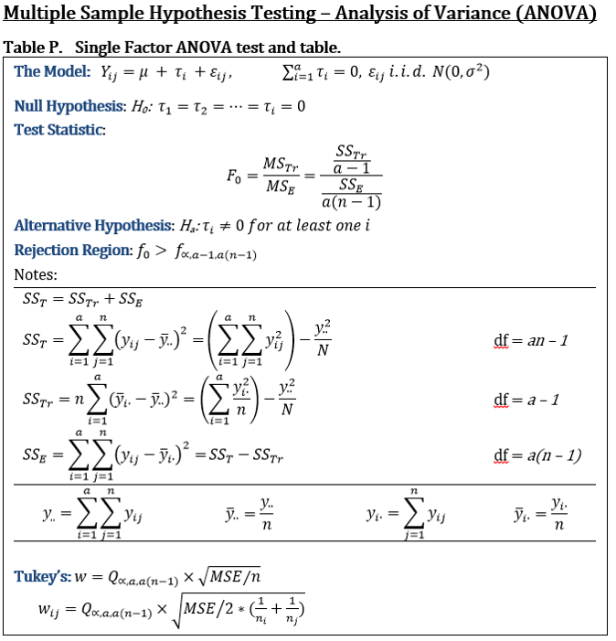
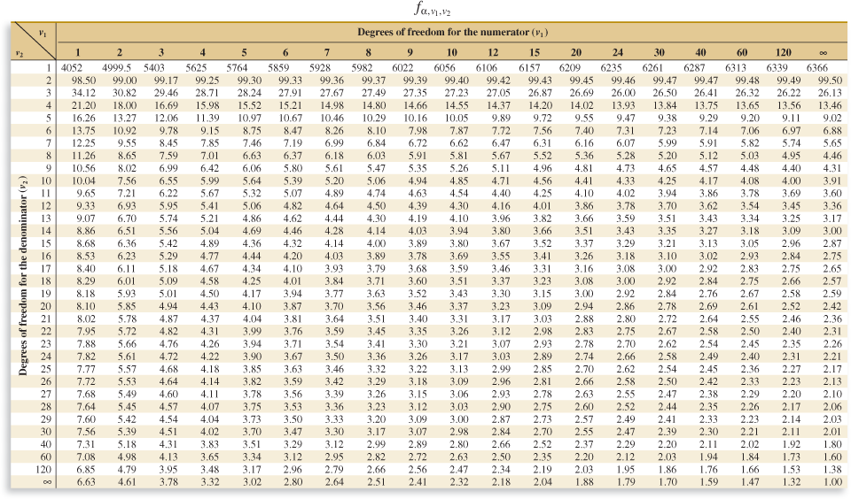
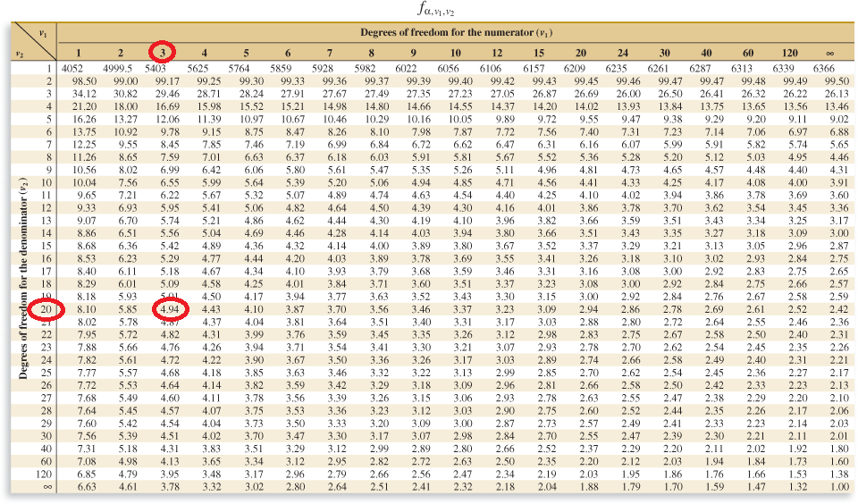

```{r, echo = FALSE}
knitr::opts_chunk$set(fig.align = 'center', warning = FALSE, message = FALSE)
```

## Where we are 

- Block 1: Hypothesis testing and regression
- <strong>Block 2: Analysis of Variance (ANOVA)
- WPR</strong>
- Block 3: Design of Experiments (DOE)
- Block 4: Statistical Quality Control (SQC)

---

## Analysis of Variance

- Analysis of variance (ANOVA) is "a method of decomposing total variability in a set of observations...into component sums of squares that are associated with specific defined sources of variation" (Montgomery, p. 787)

- In this lesson, we will use ANOVA to test for treatment effects in experiments

- Ex) (Book example, p. 541) Does increasing the % of hardwood in a paper bag make it stronger?

---

## ANOVA Terminology

- Factor = the thing that is changed in your experiment (the independent variable)
    - Ex1) The % of hardwood
- Treatments = the levels of the factor
    - Ex1) 5%, 10%, 15%, 20% (4 levels)
- Replicates = observations
    - Ex1) Observed tensile strength

---

## ANOVA and Randomization

- We will be discussing ANOVA in the context of an experiment

- Randomization is critical!

    - Observations must be taken in a random order

- Treatments must also be applied as uniformly as possible (no bias)

- We call experiments that meet these requirements Completely Randomized Design (CRD)

---

## How ANOVA Works

- We often look at data like this:

```{r, echo = FALSE}
df <- data.frame(concentration = c(5,5,5,5,5,5,10,10,10,10,10,10,15,15,15,15,15,15,20,20,20,20,20,20),
           observation = c(7,8,15,11,9,10,12,17,13,18,19,15,14,18,19,17,16,18,19,25,22,23,18,20))

df$concentration <- factor(df$concentration)
df
```

---

## How ANOVA Works

- But we could also look at it like this:

```{r, echo = FALSE}
library(magrittr)
library(kableExtra)
mat <- matrix(df$observation, ncol = 6)

colnames(mat) <- 1:6
rownames(mat) <- c('5%' ,'10%','15%','20%')

knitr::kable(mat, format = 'html', booktabs = T) %>%
  kable_styling(latex_options = c('hold_position')) %>%
  add_header_above(c('Concentration', 'Observations' = 6))
```

---

## How ANOVA Works

- Or, like this:

```{r, echo = FALSE, fig.height = 6}
library(ggplot2)

ggplot(df) + geom_density(aes(x = observation)) + facet_grid(~concentration) + theme_minimal()
```


---

## How ANOVA Works

- Or, like this:

```{r, echo = FALSE, fig.height = 6}
library(ggplot2)

ggplot(df) + geom_boxplot(aes(x = concentration, y = observation)) + theme_minimal()
```

---

## ANOVA

- We want to test if the treatment has an effect...

- We can think of this as a linear model:

$$Y_{ij}=\mu+\tau_{i}+\epsilon_{ij}$$

- Where each treatment (i) has observations (j)

---

## ANOVA Assumptions

- Observations are independent (addressed via randomization during experiment)

- Residuals ($ \epsilon $) are NID
    - Residual plots
    - Shapiro-Wilk test `shapiro.test()`

- Treatment groups have equal variance (homoscedasticity)
    - Bartlett test `bartlett.test()`


---

## ANOVA

- If we want to test if the treatment has an effect, our hypothesis test is:

$$H_{0}: \tau_{1}=\tau_{2}=...=\tau_{a}=0$$

$$H_{a}: \tau_{i}\neq0 \text{ for at least one }i$$

---

## ANOVA

- To test this hypothesis, we need a statistical test: F-test

- The F-statistic is calculated by comparing 2 different kinds of variation in your data:

    - Variation caused by the treatment = $SS_{\text{Treatments}}$
    - Variation caused by the error term = $SS_{E}$

$$F_{0} = \frac{\frac{SS_{\text{Treatments}}}{(a-1)}}{\frac{SS_{E}}{a(n-1)}}$$

- If $F_{0}$ is large, much of the variation in your data is caused by the treatment

    - Reject the null hypothesis, concluding your treatment has some effect

---

## ANOVA

<center>
  
</center>

---

## ANOVA: F-Statistic

- We will use a new statistic to compare our test statistic to: F-statistic

- Recall, our test statistic is the ratio of 2 variances

- The F-statistic is a distribution created by dividing two variances

- It tells us how likely (or unlikely) it is that we would see our calculated $F_{0}$ under the null hypothesis

---

## ANOVA: F-Statistic

- Using the F-table requires calculation of the degrees of freedom:

    - df for Numerator = df for $SS_{\text{Treatments}}$ = $a-1$

    - df for Denominator = df for $SS_{E}$ = $a(n-1)$

---

## ANOVA: F-Statistic

- F-table for $\alpha = 0.01$

<center>
  
</center>

---

## ANOVA Example

- Use ANOVA to test if increasing the concentration of hardwood has an effect on the strength of paper bags
- Use $\alpha = 0.01$

```{r, echo = FALSE}
knitr::kable(mat, format = 'html', booktabs = T) %>%
  kable_styling(latex_options = c('hold_position')) %>%
  add_header_above(c('Concentration', 'Observations' = 6))
```

---

## ANOVA Example

$$H_{0}: \tau_{1}=\tau_{2}=...=\tau_{a}=0$$
- Or, the null hypothesis is that increasing the concentration of hardwood has no effect on the strength of a paper bag

$$H_{a}: \tau_{i}\neq0 \text{ for at least one }i$$

- Or, the alternative hypothesis is that increasing the concentration of hardwood has some effect on the strength of a paper bag

---

## ANOVA Example

- Calculate $SS_{\text{T}}$

$SS_{\text{T}} = 7^2 + 8^2 + ... + 20^2 - \frac{383^2}{24}$

```{r}
SSt <- sum(df$observation^2) - (sum(df$observation)^2)/nrow(df)
SSt
```

---

## ANOVA Example

- Calculate $SS_{\text{Treatments}}$

$SS_{\text{Treatments}} = \frac{60^2+94^2+102^2+127^2}{6} - \frac{383^2}{24}$

```{r}
SStreatments <- (sum(df$observation[df$concentration == 5])^2 + sum(df$observation[df$concentration == 10])^2 +
  sum(df$observation[df$concentration == 15])^2 + sum(df$observation[df$concentration == 20])^2) / 6 - 
  (sum(df$observation)^2)/nrow(df)

SStreatments
```

---

## ANOVA Example

- Calculate $SS_{E}$

$SS_{E} = SS_{\text{T}} - SS_{\text{Treatments}} = 512.96 - 382.79 = 130.17$

```{r}
SSe <- SSt - SStreatments

SSe
```

---

## ANOVA Example

- Calculate $F_{0}$

$F_{0} = \frac{\frac{SS_{\text{Treatments}}}{(a-1)}}{\frac{SS_{E}}{a(n-1)}}=\frac{\frac{382.79}{4-1}}{\frac{130.17}{4(6-1)}}$

```{r}
a <- 4
n <- 6
F0 <- (SStreatments/(a-1))/(SSe/(a*(n-1)))
F0
```

---

## ANOVA Example

<center>
  
</center>


---

## ANOVA Example

- Conclusion: our calculated our calculated test statistic is larger than the $F_{\alpha}$ (19.60 > 4.94), so we can reject the null hypothesis, concluding that the concentration of hardwood has an effect on the strength of plastic bags.

<center>
  
</center>

---

## ANOVA Example

- In R:

```{r}
anova_model <- aov(observation ~ concentration, df)

summary(anova_model)
```

---

## ANOVA Example

- Checking assumptions:

```{r}
bartlett.test(observation ~ concentration, df)
```


- We fail to reject the null hypothesis that the variances of the samples are the same, concluding that it is plausible that the sample variances are, in fact, equal.  This satisfies our homoscedasticity assumption

---

## ANOVA Example

```{r}
shapiro.test(anova_model$residuals)
```

```{r, fig.height = 3}
plot(anova_model, which = 1)
```

- Residuals appear to be NID


