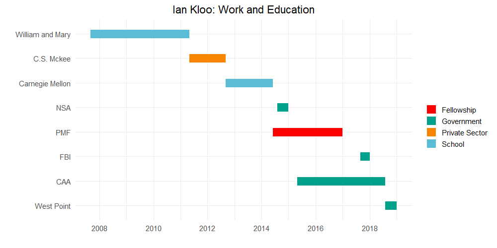
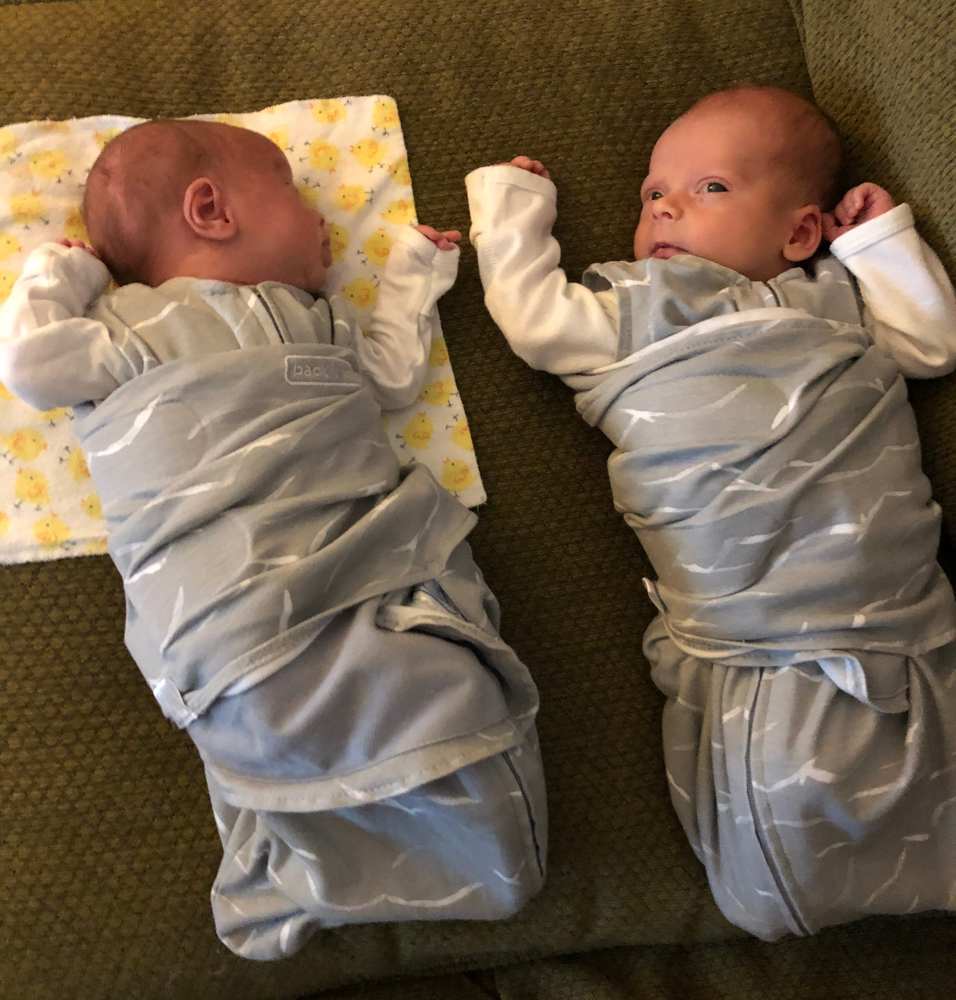
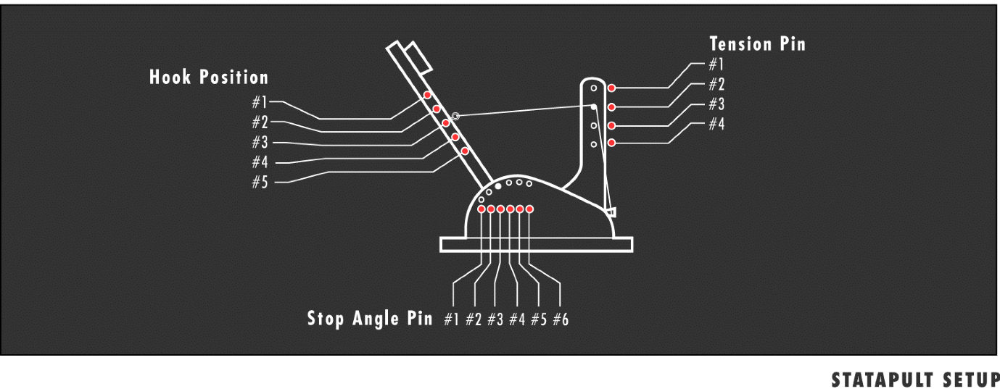
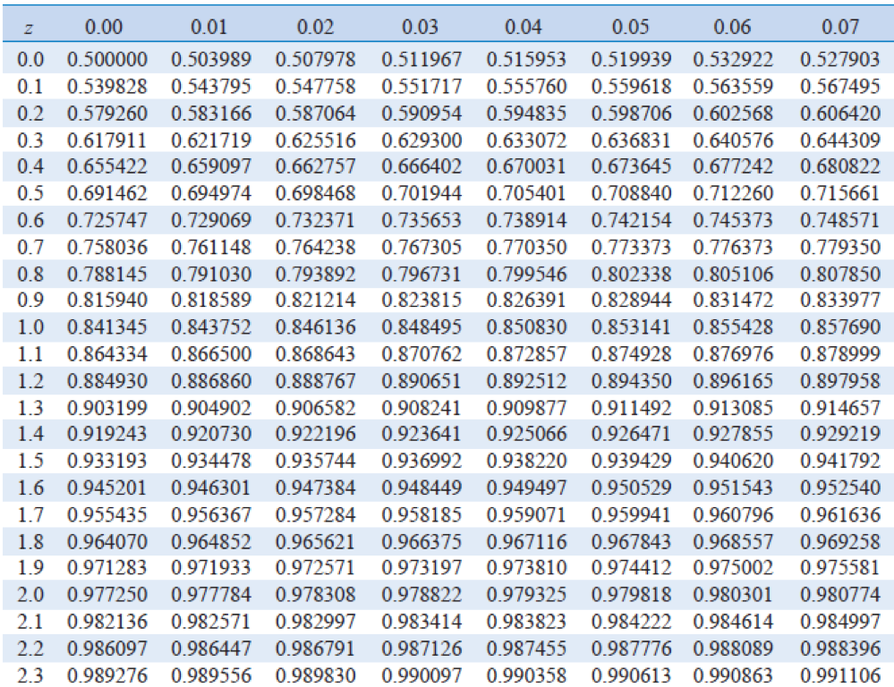
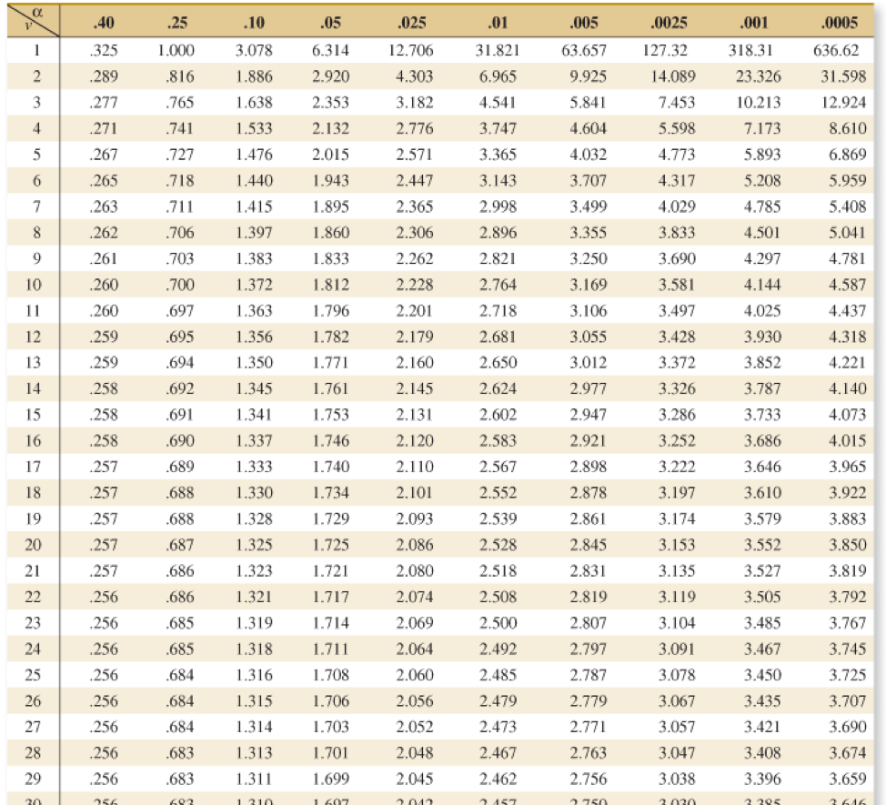
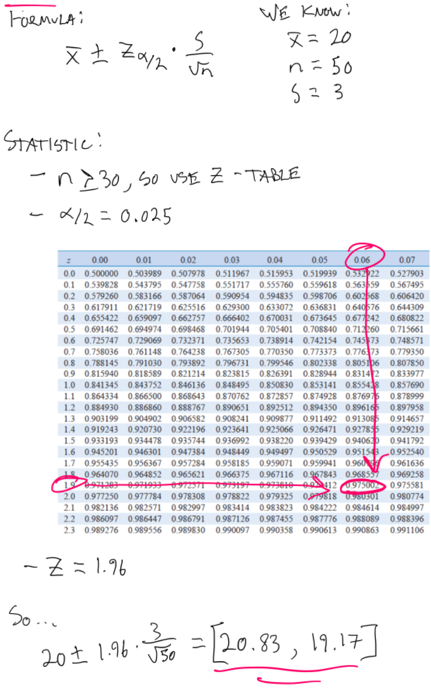

class: gray
## About me

- I'm from Pittsburgh, so go Pens and Steelers (in that order)




---

class: gray
## About me 

- I've got twins...so life is busy

<center>

</center>

---

class: gray
## About me

- DoD projects
    - Counter-threat finance (seized a bunch of money)
    - Support to OSINT analysts (wrote apps to find data people willingly give away)
    - Support to special operations (...)

- Side projects
    - NHL live in-game win probability
    - Predicting wins in DOTA 2 (eSports analytics)

- What am I doing here?
    - Teaching you!
    - Doing some research to help with the DoD projects mentioned above


---

class: gray
## Course Material

- Course Website (slides, schedule) - <a href = 'https://se375.dse-apps.com'>se375.dse-apps.com</a>
- MS Teams (discussion, quizzes)
- Applied Statistics and Probability for Engineers, Montgomery, 7th Edition - ONLINE ONLY
- SE375 Reference Handbook
- R and Rstudio 

---

class: gray
## Lectures

- Lectures are for you!

- I will try to present material in a way that you don't get in your textbook to give you another way to look at things

- I'll hit theory as quickly as possible and get to an example problem

- You'll see some code, but this won't be a "coding class"

- My style can (and probably will) change to meet the needs of this specific group - I'll need your feedback!

---

class: gray
## Class Basics

<strong>Rules</strong>

- Respect others: be on time, ready to learn (HW, Appropriate Materials, No Phones)
- No food, no drink (except approved containers - <strong>not</strong> Starbucks with a lid), no tobacco
- Coats and backpacks in the hallway
- If you need to leave early or miss a class, let me know via email
    - I cannot excuse you from missing class - I just record what happens
- It is your responsibility to reschedule WPR's 48 hours before they are given
- Primary means of communication are Teams and email
- AI - as often as you need, specific questions, come prepared
- Disputing grades
    - I make mistakes, so please correct me if you think you were graded incorrectly
    - <strong>Make all requests for grade disputes in writing</strong>
---

class: gray
## Tips to Succeed in SE375

- <strong>Remember (or relearn) what you did in MA206</strong>
    - Classes are starting to build on each other - you have to retain knowledge!
- Prep before class
    - Coming to lectures and participating alone is not enough to succeed for most
- Re-write my code, don't copy/paste
    - This helps with retention
    - There isn't much code in this class
- Communicate with me early and often if you have any problems

<strong>I'm not interested in you "getting by" in this class. My job is to teach you statistics.  You will get a good grade if you learn statistics...and a bad one if you don't.</strong>

---

class: gray
## Documentation Requirements

Source Document: DSE Policy Memo 1-3 "Academic Documentation Policy"

- Graded submissions require cover sheet/electronic acknowledgement
    - In-line documentation as necessary
- Common knowledge includes:
    - All DSE textbooks, course materials, anything on blackboard, discussions in class, discussions with your instructor
    - <strong>No need to document common knowledge</strong>
    - <strong>This does NOT equate to good scholarship, but will save you from an honor violation</strong>
- Assistance and collaboration
    - Properly, specifically documented assistance IAW and DAW Appendix A (p.21)
    - Collaboration is working together on a common project
- Best practices
    - When in doubt, document
    - Actively document sources while you're working - it's way to hard to go back and remember
- Citation style: APA

---

class: gray
## Assistance

<strong>Assistance Includes:</strong> 
- Getting a verbal answer from another person about a specific point of confusion
- Having someone show you his/her solution so you know how to proceed on your own
- Having someone show you where the errors are in your own solution
- Having someone help you fix errors in your own solution
- Using previous semester's assignments in order to derive your own answer
- Having someone explain to you exactly what to type
- Using other electronic and non-electronic resources (e.g., websites)

<strong>This all needs to be specifically documented</strong>

---

class: gray
## Assistance

.pull-left[
<strong>Good Assistance</strong>
- You are doing the typing
- The person giving assistance is both present and knowledgeable
- The person giving assistance is successfully helping you understand the material
]

.pull-right[
<strong>Bad Assistance</strong>
- Electronic copying
- Retyping someone else's solution with that person not present to explain the solution
- Reproducing someone else's solution without understanding the content
- Receiving an electronic file of someone else's work
]


---

class: gray
## Last Word on Honor Issues

- The honor system is cadet-run
- It is my responsibility to put anything that may be an honor issue to the honor system
- I don't decide if someone is guilty of an honor violation
- In my experience, the main issue is assistance - if you tell a different story in your assistance citation than another cadet, someone is wrong...and that may be an honor violation

<strong>In this class especially, it is very obvious if you copy someone's answer


---


class: gray
## Course Structure

Topic  | Lessons
------------- | -------------
Block 1: MA206 Review  | 1-3
Block 1: Extending Hypothesis Testing & Regression  | 4-11
Block 2: ANOVA | 12-20
Block 3: DOE | 21-34
Block 4: SQC | 35-39

---

class: gray
## Graded Events

Event | Lesson | Points
------------- | ------------- | -------------
Problem Set 1 | 4 | 50
Review Test | 6 | 75
Problem Set 2 | 12 | 75
Problem Set 3 | 19 | 75
WPR | 20 | 200
Problem Set 4 | 29 | 75
Project | 30 - 35 | 150
Problem Set 5 | 39 | 50
TEE | 40 | 200
Instructor Points |  | 50


---

class: gray
## Instructor Points

- There will be a reading quiz that you need to take before the start of (almost) every class

- I will post each quiz at least 24 hours before they are due and will blast a message on Teams - make sure your notifications are set accordingly

- I will drop your lowest 3 quizzes 

- <strong>You are responsible for quizzes even if you aren't in class</strong>

- That's it!  I'm not holding you hostage with instructor points.  

    - If you don't participate in class, you will likely do poorly.  Trying to give/takeaway instructor points based on class participation or other intangibles introduces too much bias
    

---

class: gray
## "Homework"

- The syllabus has recommended homework problems for each class
- I am NOT collecting these
- I recommend using these to check on your own learning, and as potential AI problems
- I will publish complete solutions (not just answers) for all of them, as we go


---


class: gray
## Course Project

STATAPULT!

<center>

</center>


---

class: gray
## Review of Major Statistical Concepts

- If you failed or did poorly in MA206, this course will be very difficult - come see me early
- If you don't know the basics, learn them quick
    - Ex) you can't tell me what a P-value and a Z-score are, competently, by the first test, you will likely fail the class
- My goal is for everyone to pass this class, but <strong>I won't pass someone who doesn't know statistics</strong>...that defeats the purpose of all of this
- If you can't do the level of statistics taught in this course, you should not be a systems engineer (not the end of the world)
- This class will be easier for those with aptitude, but anyone admitted to West Point can pass this class if they put in the work 

---

class: gray
## Why Should You Care?

- The foundation of machine learning and artificial intelligence is statistics
    - Even if you don't want to be a practitioner, you need to know how this works to be a leader
    - <strong>"Leaderology" is not sufficient in technical fields anymore</strong>

- Logically thinking about the world requires statistics
    - PhD's in statistics are doctorates in philosophy - this is a way to think

- Most people don't understand statistics well enough to apply it.  As an engineer, you can't get by without it!

- Statistics is heavily tested on the Fundamentals of Engineering Exam (FEE)


---

class: gray
## Confidence Intervals

- Need average age of cows at USMA, but birthdays are PII...how can we estimate it?

- We could just ask everyone...
    1. Would take forever
    2. Maybe someone won't answer the survey
    
- We could ask a small number and estimate the mean of the <font color='blue'>population</font> based on the mean of the <font color='red'>sample</font>

- The <font color='red'>sample mean ( $\overline{x}$ )</font> will not exactly estimate <font color='blue'>population mean ( $\mu$ ) </font>, so we need to report a <strong>confidence interval</strong>

---

class: gray
## Confidence Intervals

- General formula:

$$\text{point estimate } \pm \text{ statistic }_\frac{\alpha}{2} * \text{standard error}$$
    
- Point estimate = <font color='red'> $\overline{x}$ </font>
- Statistic:
    1. If $n \geq 30$, use a z-statistic
    2. If $n < 30$, use a t-statistic 
- Standard Error:
    1. If you have <font color='blue'> $\sigma$ </font>, use $\frac{\sigma}{\sqrt{n}}$
    2. If you only have <font color='red'> $S$ </font>, use $\frac{S}{\sqrt{n}}$ 

- Intuition:
    - Bigger standard error, bigger confidence interval
    - Smaller $n$, bigger confidence interval
    - Smaller $\alpha$ bigger confidence interval 
---

class: gray
## Key Concept: Central Limit Theorem

- We can use z- and t-statistics because of the CLT

- No matter what your data looks like,
    - Take a bunch of samples and calculate the means
    - The distribution of these means (sampling distribution) will approach a normal distribution!
    
- So...if we take a sample and calculate the mean, we can use the normal distribution to say something about the population mean
    
- <a href = https://gallery.shinyapps.io/CLT_mean/>Demo</a>

---

class: gray
## Confidence Intervals

- Using a z table (if $n \geq 30$ --> uses a normal distribution) 

<center>
  
</center>


---

class: gray
## Confidence Intervals

- Using a t table (if $n < 30$ --> uses a modified, more conservative, distribution that is similar to the normal distribution)

<center>
  
</center>

---


class: gray
## Confidence Intervals

- Interpreting CI's

- Ex) 95% CI
    - If we repeatedly take samples of the population and calculate the mean, the population mean will fall within our calculated CI 95% of the time
    - OK to interpret in plain language as "there is a 95% chance the population mean is within this range"
    
- What we can't say:
    - How close the population and sample means likely are
    - Anything meaningful about the population or sample distributions other than the means of both

- This helps: https://rpsychologist.com/d3/CI/

---


class: gray
## Confidence Intervals: Practice Problem

- Want to know the age of the average cow at USMA, but don't have time to ask everyone

- You asked 50 cadets and got the following information:
    - Mean: 20
    - Standard Deviation (of sample): 3
    
- Use this information to create and interpret a 95% confidence interval to say something about the mean of all USMA cows

---

class: gray
## Confidence Intervals: Practice Problem

<center>
  
</center>


---


class: gray
## Confidence Intervals: Practice Problem - Coded Solution

```{r, echo = TRUE}
z_stat <- qnorm(.025, lower.tail = FALSE)
st_error <- 3 / (sqrt(50)) 
upper <- 20 + (z_stat * st_error)
lower <- 20 - (z_stat * st_error)

upper
lower
```


- With 95% confidence, we state the mean age of cows is between `r upper` and `r lower`

- There is a 5% chance the true mean age is not within our CI


